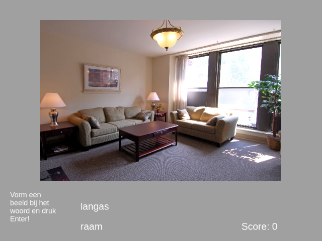
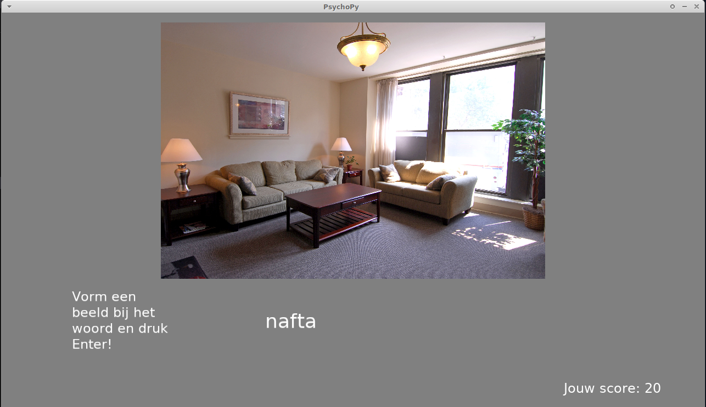

# Memprize Submission by Team Radboud University

Reimplementation of the [submission for the memprize competition 2016/2017](https://www.psychologicalscience.org/publications/observer/obsonline/radboud-university-researchers-win-first-memrise-prize.html) (Potts et al., 2023)[^1]

The repository contains two versions of the experiment backing the submission:

1. The original Psychopy implementation, but updated to Python3 and using the
    newest Psychopy 2023.02.0 release.
2. A web-implementation of the same algorithm that can run in the browser.

## Copying and license

The source code is published under the MIT License, see [LICENSE.md](LICENSE.md).

The _images_ in this repository are published under a variety of licenses.
Refer to the [IMAGE-ATTRIBUTIONS.md](IMAGE-ATTRIBUTIONS.md) for details.

## Web version

You can try out the web version here: [https://memprize.craftware.info/](https://memprize.craftware.info/)

See below for details how to run the web version.

## The original Psychopy version

(Dutch only)

The original version of the experiment for testing the spacing algorithm. See below for details how to run the web version.

## Citation

To cite this software in your publications, you can use the [CITATION.cff file through GitHub](https://docs.github.com/en/repositories/managing-your-repositorys-settings-and-features/customizing-your-repository/about-citation-files) page or the following reference:

> van den Broek, G. S. E., Gerke, P. K., Albers, A. M., Berkers, R., van Kesteren, M., Konrad, B., & Müller, N. (2023). Memprize Submission by Team Radboud University (Version 1.0) [Computer software]. https://doi.org/10.5281/zenodo.8373054

## Steps for running the original Psychopy version

Required software:

- python 3.10 (or higher)
- [`pipenv` for Python](https://pypi.org/project/pipenv/)

With these packages installed:

- Clone the repository
- Change in the directory `psychopy`
- If you are using a python-version other than 3.10, edit the `Pipfile` and
  replace the version string 3.10 with the version you are using.
- Issue the command `pipenv install`
  - This _should_ install PsychoPy in a pipenv-environment. However, PsychoPy
    is a relatively heavy package with a lot of dependencies and might be more
    complicated to install on your system. If you encounter errors, try the
    alternative steps below.
- Now you can run the application using the command:

~~~~~~~~~.sh
pipenv run python main.py 
~~~~~~~~~

## Alternative steps for running the original Psychopy version

These steps are easier in case you are not able to install PsychoPy using the
steps above. These steps will run the program through a pre-built Standalone
PsychoPy bundle instead.

Note: These steps do not work on Linux and were only tested on Windows!

Required software:

- Install [PsychoPy](https://www.psychopy.org/) version 2023.02.0 in some other way
  - You sould be able to download the exact version from the release page:
  https://github.com/psychopy/psychopy/releases/tag/2023.2.0

Then:

- Clone the repository
- Change in the directory `psychopy`
- Run the experiment's `main.py` file as described in the previous section, but
  use the python version that ships with psychopy.

[^1]: Potts, R., van den Broek, G.S.E., Albers, A.M., Balaguer, J., Berkers, R., de Jonge, M., Dhanani, A., Jivani, A., Gerke, P.K., Konrad, B., Küpper-Tetzel, C.E., Hae Li, J., McDaniel, M., Miyatsu, T., Müller, N., Nguyen, K., Reilly, W., Summerfield, C., … Shanks, D.R. (2023). Optimal methods for learning foreign-language vocabulary: An international research competition. [Manuscript submitted for publication]. University College London. 
