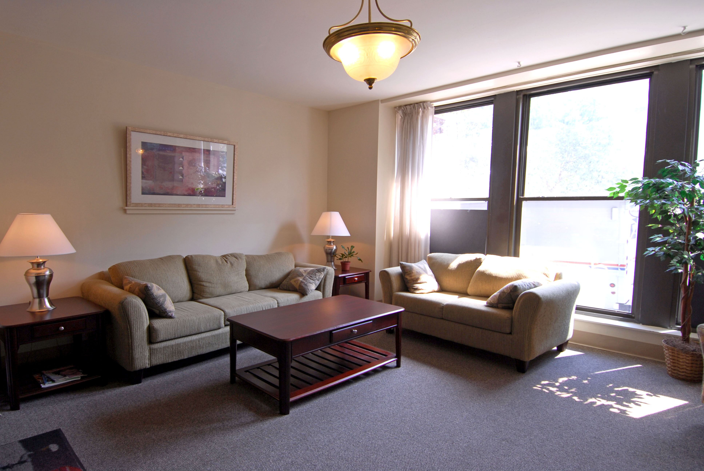

# Room 1

- Source: https://commons.wikimedia.org/wiki/File:Stafford_livingroom.jpg
- Author: Aimcotest
- License: [Attribution-ShareAlike 3.0 Unported (CC BY-SA 3.0) ](https://creativecommons.org/licenses/by-sa/3.0/deed.en)

# Room 2

- Source: https://pxhere.com/en/photo/926717
- Author: _Unknown_
- License: Public Domain

# Room 3

- Source: https://www.flickr.com/photos/84063900@N02/7697116148
- Author: Holland And Green Architectural Design
- License: [Attribution 2.0 Generic (CC BY 2.0) ](https://creativecommons.org/licenses/by/2.0/)

# Room 4

- Source: https://commons.wikimedia.org/wiki/File:Bedroom_Mitcham.jpg
- Author: Tim Collins
- License: [Attribution-ShareAlike 3.0 Unported (CC BY-SA 3.0)](https://creativecommons.org/licenses/by-sa/3.0/deed.en)

# Room 5

- Source: https://unsplash.com/photos/RcdV8rnXSeE
- Author: Vadim Sherbakov
- License: [Unsplash Lizenz](https://unsplash.com/de/lizenz)

# Room 6

- Source: https://commons.wikimedia.org/wiki/File:HK_Central_%E6%93%BA%E8%8A%B1%E8%A1%97_Lyndhurst_Terrace_sidewalk_restuarant_bar_table_n_chairs_n_tender_Oct-2011.jpg
- Author: Lyd0286
- License: [Attribution-ShareAlike 3.0 Unported (CC BY-SA 3.0)](https://creativecommons.org/licenses/by-sa/3.0/deed.en)

# Room 7

- Source: https://unsplash.com/photos/PDRFeeDniCk
- Author: Ivan Aleksic
- License: [Unsplash Lizenz](https://unsplash.com/de/lizenz)

# Room 8

- Source: https://unsplash.com/photos/dyj7RTs85Fs
- Author: Humphrey Muleba
- License: [Unsplash Lizenz](https://unsplash.com/de/lizenz)

# Room 9

- Source: https://unsplash.com/photos/RUUXi7hCy2s
- Author: Geoffrey Chevtchenko
- License: [Unsplash Lizenz](https://unsplash.com/de/lizenz)

# Room 10

- Source: https://en.wikipedia.org/wiki/File:Kyoto_Botanical_Garden_-_sunken_garden.JPG
- Author: [Daderot](https://commons.wikimedia.org/wiki/User:Daderot)
- License: [Attribution-ShareAlike 3.0 Unported (CC BY-SA 3.0)](https://creativecommons.org/licenses/by-sa/3.0/deed.en)
